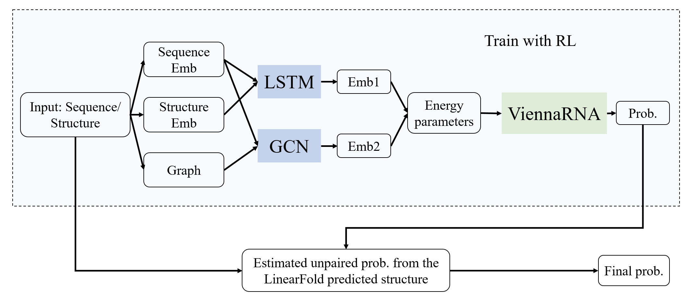

## Create env & run 
>bash run.sh

The test results are saved in the folder _./result_

## Method

We aim to predict the unpaired probability by estimating the energy parameters in ViennaRNA.

* Reinforcement learning module: As illustrated in the figure, we first extract features from the RNA sequence and the predicted structure by a LSTM module and a GCN module. Then the energy parameters are predicted from the extracted feature vector. The ViennaRNA predict the unpair probability with the given parameters. To optimize the parameters in the deep learning model, reinforcement learning strategies are used. 

* Refining module: In practice, we noticed that few RNA structures cannot be accurately predicted by ViennaRNA even with the optimized energy parameters. We compare the  

